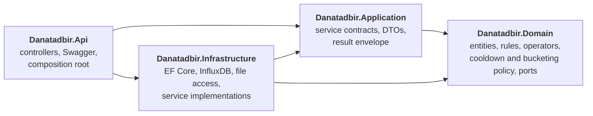

# Danatadbir — Sensor Ingestion, Stateful Rule Engine & Alerting

A backend service that ingests sensor readings from a JSON Lines file, rejects malformed, invalid
and duplicate records, evaluates the rest against rules loaded from `rules.json` (including the
stateful `SustainedAbove` operator), raises cooldown-deduplicated alerts, and exposes time-bucketed
aggregates of the acceptable readings.

.NET 10 · ASP.NET Core · Clean Architecture · EF Core / PostgreSQL · InfluxDB · Swagger · xUnit

## The task at a glance

| # | Deliverable | Where it lives |
| --- | --- | --- |
| 1 | Ingestion | `POST /api/v1/ingestion/run`, [Ingestion](#ingestion) |
| 2 | Storage, justified | PostgreSQL and InfluxDB, [Technology choices](#technology-choices) |
| 3 | Rules as seed data | `Data/rules.json`, loaded at startup, [Rule model](#rule-model-and-evaluation-policy) |
| 4 | Rule evaluation | Operators in the Domain layer, [Rule model](#rule-model-and-evaluation-policy) |
| 5 | Alerting with cooldown | [Alerting and cooldown](#alerting-and-cooldown) |
| 6 | Acceptable / unacceptable lists | `GET /readings/acceptable`, `GET /readings/unacceptable`, [Aggregation](#acceptable-readings-and-aggregation) |
| 7 | Aggregation API | `GET /readings/aggregates`, [Aggregation](#acceptable-readings-and-aggregation) |
| 8 | Idempotent re-run | Natural keys enforced by both stores, [keying strategy](#keying-strategy-for-idempotency), `IdempotencyTests` |
| 9 | Processing report | Returned by the ingestion call and logged, [Processing report](#processing-report) |
| 10 | Tests | 267 tests, [Tests](#tests) |
| 11 | README | this file |

## Contents

- [Running and testing](#running-and-testing)
- [Architecture](#architecture)
- [Technology choices](#technology-choices)
- [Ingestion](#ingestion)
- [Rule model and evaluation policy](#rule-model-and-evaluation-policy)
- [SustainedAbove: state and ordering](#sustainedabove-state-and-ordering)
- [Alerting and cooldown](#alerting-and-cooldown)
- [Acceptable readings and aggregation](#acceptable-readings-and-aggregation)
- [Processing report](#processing-report)
- [Tests](#tests)
- [Trade-offs and known limits](#trade-offs-and-known-limits)
- [AI tool usage](#ai-tool-usage)

## Running and testing

Requirements: .NET 10 SDK and Docker.

```bash
# 1. PostgreSQL and InfluxDB
cd Docker && cp .env.example .env && docker compose up -d && cd ..

# 2. Restore packages, then create the schema and seed data (4 sensors, 3 metrics).
#    `dotnet ef` does not restore by itself, so on a fresh checkout it needs the first line.
dotnet restore
dotnet tool restore
dotnet ef database update --project Danatadbir.Infrastructure --startup-project Danatadbir.Api

# 3. API
dotnet run --project Danatadbir.Api
```

| Service | Address | Notes |
| --- | --- | --- |
| Swagger UI | http://localhost:5080/swagger | one document per API version; `/` redirects here |
| Health | http://localhost:5080/api/v1/health | PostgreSQL and InfluxDB connectivity |
| InfluxDB UI | http://localhost:8086 | org `danatadbir`, bucket `sensor_readings`, credentials in `Docker/.env` |
| PostgreSQL | localhost:5432 | database `danatadbir`, user `core_user` |

Process the supplied feed, then read the results:

```bash
curl -X POST "http://localhost:5080/api/v1/ingestion/run"        # Data/readings.jsonl by default
```

Running it a second time changes nothing: same report, no new rows.

| Endpoint | Purpose |
| --- | --- |
| `POST /api/v1/ingestion/run[?path=]` | Process a feed and return the report |
| `GET /api/v1/readings/aggregates?deviceId&metric&from&to&bucketSeconds` | Per-bucket count, average, min and max of the **acceptable** readings |
| `GET /api/v1/readings/acceptable?deviceId&metric&from&to[&page&pageSize]` | The acceptable readings |
| `GET /api/v1/readings/unacceptable?deviceId&metric&from&to[&page&pageSize]` | The unacceptable readings, with the rules broken and why |
| `GET /api/v1/alerts[?deviceId&metric&ruleId&from&to&page&pageSize]` | Alerts raised by sustained rules |
| `GET /api/v1/health` | Dependency health |

Of these, only the aggregation endpoint is required by the task; the others exist so that every output
of the pipeline can be inspected without querying a database.

```bash
curl "http://localhost:5080/api/v1/readings/aggregates?deviceId=PUMP-01&metric=vibration&from=2025-06-01T08:00:00Z&to=2025-06-01T08:03:00Z&bucketSeconds=60"
curl "http://localhost:5080/api/v1/alerts"
```

Tests need neither Docker nor a database:

```bash
dotnet test
```

**Configuration.** `dotnet run` uses the `http` launch profile, which sets `ASPNETCORE_ENVIRONMENT=Development`;
the connection strings live in `Danatadbir.Api/appsettings.Development.json`. Started in any other
environment the service refuses to boot until they are supplied, for example as environment variables:
`ConnectionStrings__PostgresConnection`, `InfluxDb__Url`, `InfluxDb__Token`, `InfluxDb__Organization`,
`InfluxDb__Bucket`. The rules file, the default feed and the batch sizes are under `Rules` and `Ingestion`
in `appsettings.json`.

**Resetting.** To throw everything away and start clean:

```bash
cd Docker && docker compose down -v      # removes the containers and both databases' volumes
```

then repeat steps 1 and 2. Credentials in `Docker/` are development-only defaults, overridable through
the gitignored `Docker/.env`.

## Architecture

### Why a layered, Clean Architecture

Clean Architecture has one rule that everything else follows from: **source-code dependencies point
inwards only.** The inner layers describe *what the system does*: its entities, rules and policies.
The outer layers decide *how* that is delivered (HTTP, Swagger) and *where* it is kept (PostgreSQL,
InfluxDB, a file on disk). An inner layer never names anything from an outer one; when it needs
something from the outside world it declares an **interface (a port)** and lets the outer layer supply
the **implementation (an adapter)**.



This fits the task closely, and that is the reason to use it here rather than habit:

- The task requires that **domain logic is independent of infrastructure** and that validation,
  deduplication, applicability, evaluation, state handling, alerting and classification stay out of
  controllers and repositories.
- The task names three axes of extension: **new operators, new input sources, new aggregations.** Each
  one is a seam in the design: an operator is a class registered in one line, an input source is an
  implementation of `IReadingLineSource`, and an aggregation is a pure function over readings.
- **Testability.** Because the rule engine, the cooldown policy and the bucketing touch no store, they
  are tested directly. The pipeline tests replace the stores with in-memory implementations of the
  same ports, so 267 tests run in about a second with no database or Docker.
- **Replaceable storage.** Swapping InfluxDB for another store, or the JSON Lines file for another
  source, changes one adapter and nothing else.

The cost is more files and more indirection than a two-day task strictly needs. I accepted that because
the design is what the task grades, and because I already had this structure from a previous project.

### The four projects

| Project | Responsibility | References | Contains | Must never contain |
| --- | --- | --- | --- | --- |
| **`Danatadbir.Domain`** | The business rules, as they would exist with no database and no web server | nothing (no project reference, no NuGet package) | Entities (`Sensor`, `Metric`, `SensorData`, `RuleResult`, `Alert`); the rule model and its **applicability**; every operator and its parameter type, including the stateful `SustainedAbove`; `CooldownPlanner` (which episodes become alerts); `TimeBucketAggregator`; the **ports** for persistence (`ISensorDataRepository`, `IRuleResultRepository`, `IAlertRepository`, `ISensorRepository`, `IMetricRepository`) | EF attributes, JSON, HTTP, logging, any I/O |
| **`Danatadbir.Application`** | What the system offers to its callers | Domain (no NuGet package) | Service **contracts** (`IIngestionService`, `IAlertingService`, `IReadingQueryService`, `IAlertQueryService`, `IRuleEvaluationService`, `IEpisodeDetectionService`); the DTOs and the `BaseResult` envelope; the `Paging` helper; ports to non-persistence dependencies (`IReadingLineSource`, `IRuleCatalog`) | Implementations, EF Core, HTTP types |
| **`Danatadbir.Infrastructure`** | Everything that touches the outside world, plus the orchestration that uses it | Domain, Application | **Adapters:** the EF Core context, configurations, migrations and audit interceptor; the repositories; the InfluxDB reader/writer; the JSON Lines file reader; the `rules.json` loader. **Service implementations:** the ingestion pipeline, rule evaluation, episode detection, alerting and the read-side queries. Health checks and DI registration | Controllers or any HTTP concept |
| **`Danatadbir.Api`** | Delivery over HTTP | Application, Infrastructure (only to wire it up) | Thin controllers, API versioning, Swagger, the model-validation filter, the exception middleware, and `Program.cs`, the **composition root** | Business logic. A controller calls one service and maps its `BaseResult` to a status code |

`Danatadbir.Tests` references all three inner projects and nothing from `Api`. Domain and Application
have no NuGet packages at all; that is checked in the `.csproj` files, not just intended.

### Following one request through the layers

`POST /api/v1/ingestion/run`:

1. **Api.** `IngestionController` calls `IIngestionService.IngestAsync` and turns the returned
   `BaseResult` into a status code. It contains no logic.
2. **Infrastructure.** `IngestionService` streams lines from `IReadingLineSource` (here the JSON Lines
   adapter), parses and validates each one, resolves sensor and metric against the seed data, and
   deduplicates by `(sensor, metric, ts, seq)`.
3. **Application and Domain.** Each surviving reading is evaluated by `IRuleEvaluationService` using the
   operators in **Domain**. Each series is scanned for episodes by `SustainedAboveOperator`, also
   Domain. `CooldownPlanner`, Domain again, decides which episodes become alerts.
4. **Infrastructure.** The results go out through the ports: readings to InfluxDB
   (`InfluxSensorDataRepository`), rule results and alerts to PostgreSQL (EF Core repositories).
5. The report is built and returned back up through the same layers.

`GET /api/v1/readings/aggregates` takes the same road in reverse: `ReadingsController` →
`IReadingQueryService` → the two repositories → `TimeBucketAggregator` in Domain.

### Ports and adapters

| Port (interface) | Declared in | Adapter | Store or medium |
| --- | --- | --- | --- |
| `ISensorDataRepository` | Domain | `InfluxSensorDataRepository` | InfluxDB |
| `IRuleResultRepository`, `IAlertRepository`, `ISensorRepository`, `IMetricRepository` | Domain | EF Core repositories over `AppDbContext` | PostgreSQL |
| `IReadingLineSource` | Application | `JsonlFileReadingLineSource` | a JSON Lines file |
| `IRuleCatalog` | Application | `RuleCatalog` (parses and validates `rules.json`) | a JSON file |
| `IRuleOperator` and its two branches | Domain | one class per operator | none: a plug-in seam rather than an I/O port |

The same ports are implemented a second time by in-memory fakes in `Danatadbir.Tests/Fakes`, which is
what lets the whole pipeline run in a unit test.

### Wiring

`Program.cs` is the only place that knows every layer. It calls `AddApiServices` and
`AddInfrastructureServices`, each of which composes small registration files, one per concern
(`BindRepositories`, `BindApplicationServices`, `BindRuleOperators`, `AddDbContext`, `AddInfluxDb`,
`AddHealthChecks`, `Swagger`, `ApiVersioning`). Services and repositories are registered the same way, an
interface bound to its implementation. Operators are registered as `IRuleOperator` and the rule loader
receives all of them as one collection, which is why adding an operator needs no change to any
existing code.

### Conventions inherited from Taghsim

The layout and conventions come from **[Taghsim](https://github.com/Aliizi83/Taghsim)**, a project I built
earlier, so the effort here goes into the domain problem rather than structural decisions:

- every response is a `BaseResult` / `BaseResult<T>` envelope, mapped to a status code by `BaseController`;
- registration is split into one file per concern under `ServiceCollections/`;
- `BaseEntity` carries audit timestamps and soft delete, applied by `AuditSaveChangesInterceptor` and a
  global query filter;
- API versioning is in the URL (`/api/v1/...`), with one Swagger document per version;
- **service implementations live in Infrastructure, not Application.** Application holds the contract
  and Infrastructure the implementation, bound in DI exactly like a repository.

### A deliberate deviation, and what it costs

That last convention has a consequence worth stating. The textbook places use-case implementations in the
Application layer. Here they are in Infrastructure, so the orchestration around the rules (the ingestion
pipeline, the line parser, deduplication, rule evaluation and episode detection) sits next to the
adapters. The dependency rule still holds, because Infrastructure depends inwards, and none of these
classes touches a database or a socket: they depend only on ports and on the logging and options
abstractions. The reason they cannot simply move to Application is that Application has no NuGet
packages by design, and they use `ILogger` and `IOptions`.

What did go to Domain is the logic that carries the business meaning: what a rule means, which readings
it covers, how an operator decides, how an episode is found, when an alert is raised or suppressed, and
how a bucket is computed. If the orchestration were to move, it would move to Application unchanged.

### Extension points

| To add | Do this | Touches existing code? |
| --- | --- | --- |
| An operator | A parameters record and an operator class, one registration line | No |
| An input source (another file format, a socket) | Implement `IReadingLineSource`, register it | No |
| An aggregation | A pure function over `SensorData` in Domain, exposed by a query service | No |
| A rule | A new entry in `rules.json` | No. The process needs a restart, not a rebuild |
| A different time-series store | Implement `ISensorDataRepository` | No |

### Solution layout

```
Danatadbir.sln
├── Data/                                  readings.jsonl (the feed) and rules.json (seed rules)
├── Docker/                                docker-compose.yml, .env.example, postgres init script
├── Danatadbir.Domain/
│   ├── Entities/                          Sensor, Metric, SensorData, RuleResult, Alert, BaseEntity
│   ├── Rules/                             Rule, IRuleOperator, evaluation and episode types
│   │   ├── Operators/                     the 7 operators
│   │   └── Parameters/                    one parameter type per operator, each validating itself
│   ├── Alerting/                          CooldownPlanner, AlertSeriesKey
│   ├── Aggregation/                       TimeBucketAggregator
│   └── Repositories/                      persistence ports
├── Danatadbir.Application/
│   ├── IngestionService/  RuleService/  AlertService/  ReadingService/   contracts and DTOs per use case
│   └── Common/                            BaseResult, PaginationMetaData, Paging, IUnitOfWork
├── Danatadbir.Infrastructure/
│   ├── Persistence/                       AppDbContext, Configurations (incl. seed data), Migrations, Interceptors
│   ├── Repositories/                      EF Core repositories
│   ├── TimeSeries/                        InfluxSensorDataRepository
│   ├── Services/                          Ingestion/, Rules/, Alerting/, Readings/ implementations
│   ├── HealthChecks/  Options/  ServiceCollections/
├── Danatadbir.Api/
│   ├── Controllers/V1/                    Ingestion, Readings, Alerts, Health
│   ├── Filters/  Middlewares/  Swagger/  ServiceCollections/  Program.cs
└── Danatadbir.Tests/                      Domain, Rules, Ingestion, Alerting, Readings, Fakes
```

## Technology choices

The task lets the candidate choose the storage engine and asks for the choice to be justified. Two
stores are used, split by the kind of data they hold:

| Store | Holds | Why |
| --- | --- | --- |
| **InfluxDB** | Raw readings | The readings are a time series: appended, never edited, addressed by (series, time), read by time range and summarised in time buckets |
| **PostgreSQL** | Sensors, metrics (seed data), rule results, alerts | Small relational data with real constraints, where a unique index is what guarantees idempotency |

Rules are **not** stored. The task asks for them to be loaded from `rules.json` at startup and rules out
any management API, so they live in memory, are validated once at startup, and changing the file needs a
restart. Rule results and alerts therefore refer to a rule by its id alone, with no foreign key, and copy
the rule name so they stay readable if the file later changes.

### Why PostgreSQL

- **The data is relational and constraint-heavy.** Sensors and metrics are reference data with unique
  keys; rule results and alerts are derived records with natural keys. A relational database expresses
  exactly that.
- **Unique indexes give the idempotency guarantee at the storage level**, not just in application code.
  `ix_rule_results_reading_rule` and `ix_alerts_rule_series_start` make a second copy impossible even if
  the code above them were wrong; the alerts index was checked directly by inserting the same key twice.
- **Schema and seed data are versioned.** EF Core migrations create the tables and insert the four
  sensors and three metrics, so a fresh database is one command away and the schema evolves in reviewable
  steps.
- **Familiarity.** It is the same stack (EF Core with Npgsql) as Taghsim, which keeps the persistence
  code conventional and lets the effort go into the domain.

The task also allows in-memory storage or SQLite, and for 2,150 readings either would work. I chose
PostgreSQL to keep the persistence design realistic (constraints, concurrent access, migrations) rather
than minimal. The price is that running the project needs Docker.

### Why InfluxDB

- **The workload is a time series.** A reading is written once and never changed, belongs to a series
  (sensor and metric) and to a moment, and is later read back by time range and summarised into buckets.
  A time-series database is built for that access pattern.
- **Its data model matches the idempotency requirement.** A point in InfluxDB is identified by its
  measurement, its tag set and its timestamp, and writing the same identity again overwrites the point.
  Storing `sensor`, `metric` and `seq` as tags makes the task's own duplicate definition,
  `(deviceId, metric, ts, seq)`, exactly the identity of a point, so re-running a file rewrites the same
  points instead of adding new ones.
- **Room to grow.** Retention policies, downsampling and native windowed aggregation are there if the
  volume ever justified them.

InfluxDB is used here for storage and for range reads. The bucketing itself is done in the Domain layer
(`TimeBucketAggregator`) rather than pushed down into a Flux query, so that it is testable without the
database and does not depend on one. Pushing it down would be the way to scale it.

**Alternatives considered.**

| Option | Verdict |
| --- | --- |
| In-memory or SQLite for everything | Allowed by the task and enough for this volume, but it sidesteps the storage question the task asks to be justified |
| PostgreSQL alone, with a plain table or a time-series extension such as TimescaleDB | A sound, simpler choice with one engine to run. A single store would also give one transaction over readings and results |
| **CrateDB** | Could have replaced InfluxDB. It is a distributed SQL database that handles time-series and analytical workloads and could have covered both jobs in one engine |
| **InfluxDB** | **Chosen** |

I could have used CrateDB instead of InfluxDB, and that would have been a legitimate choice. I decided on
InfluxDB because it is a technology I did not know, and I wanted this task to be a chance to challenge
myself with a purpose-built time-series database rather than stay with what I already use. It comes with
real friction: a second query language (Flux), a tag and field data model to learn, and a second store to
operate. Those costs are listed under [Trade-offs](#trade-offs-and-known-limits).

### Keying strategy for idempotency

Processing the same file twice must not create a second copy of anything. Each output has a natural
key, and the store enforces it:

| Output | Key | Enforced by |
| --- | --- | --- |
| Reading | `(sensor, metric, ts, seq)` | InfluxDB: a point is identified by measurement + tags + timestamp, so `sensor`, `metric` and `seq` are tags and rewriting the same reading overwrites its point |
| Rule result | `(sensor, metric, ts, seq, rule)` | Unique index in PostgreSQL, plus a sync that inserts missing rows and removes stored ones that no longer hold |
| Alert | `(rule, sensor, metric, startTs)` | Unique index in PostgreSQL, plus an insert that skips existing keys |

`seq` is a **tag**, not a field, on purpose. The feed contains readings that share
`(sensor, metric, ts)` but differ in `seq`; by the task's definition they are distinct readings.
With `seq` as a field they would silently overwrite each other.

## Ingestion

`POST /api/v1/ingestion/run[?path=...]` reads a JSON Lines feed line by line (never the whole file
in memory), and returns the [processing report](#processing-report).

A line is rejected, counted and sampled, never crashing the run:

| Reason | Meaning |
| --- | --- |
| `Malformed` | Not valid JSON, or a field of the wrong type (`"value": "abc"`) |
| `InvalidField` | Parsed, but `deviceId`, `metric`, `ts`, `value` or `seq` is missing, empty or not usable |
| `UnknownSensorOrMetric` | The sensor or metric is not registered seed data |
| `Duplicate` | The `(sensor, metric, ts, seq)` was already seen in this run |

Rejected and duplicate readings never reach evaluation and are never counted as unacceptable: a
rule violation is a business outcome of a valid reading, not a data-quality problem.

**Timestamps.** Only ISO-8601 is accepted (`2025-06-01T08:33:00Z`, with an optional fraction or
offset). A timestamp without an offset is read as UTC, as the feed is documented to be UTC.
Anything else is rejected instead of guessed: a lenient parser reads `08:33:00` as today's date and
`03/01/2030` as an American date, which would make the result depend on the machine.

**Sensors and metrics** are matched case-insensitively and stored in their registered spelling, so
`pump-01` and `PUMP-01` are one series, not two tags.

**Deduplication policy: last wins.** When the same `(sensor, metric, ts, seq)` appears more than
once, the last occurrence replaces earlier ones. A resent line is more likely a correction than an
accident, and the feed shows it: 8 of its 38 duplicates carry a different value. The winner is only
known once the file ends, so readings are resolved first and evaluated afterwards; the cost is one
dictionary of the distinct readings, the same order of memory as a set of keys.

**Order.** The feed is not time-sorted, so nothing depends on file order. Surviving readings are
processed sorted by `(sensor, metric, event time, seq)`, and the result is identical whether the file
is in order, shuffled or reversed. The one exception is by definition: when two lines carry the same
`(sensor, metric, ts, seq)` with *different* values, the later line in the file wins, so reordering
such a file changes which value survives.

**Re-processing a reading whose value changed.** InfluxDB overwrites the point, so the stored
violations are kept in step rather than left behind: after evaluation, the rule results of every
reading in the file are synchronised, inserting missing ones and removing those that no longer hold.
A reading corrected from `500` to `50` loses its violation and moves to the acceptable list; the
report shows how many stale rows were removed. Without this a corrected reading would stay excluded
from the aggregation. (Alerts are different: see below.)

**Logging.** Each bad line is logged as a warning with its line number, reason and detail, up to 20
individually (`Ingestion:RejectionSampleLimit`) followed by a count of the rest, so a badly broken
file cannot flood the log. Duplicates are a policy outcome, not a fault, and are only logged at debug.
Rules that fail to load, sustained episodes, alerts raised and episodes suppressed are logged too.

## Rule model and evaluation policy

`Data/rules.json` is loaded once at startup:

```json
{
  "id": "pump02-overheating-sustained",
  "name": "Pump 02 Overheating Sustained",
  "metric": "temperature",
  "deviceId": "PUMP-02",
  "operator": "SustainedAbove",
  "enabled": true,
  "operatorParameters": { "threshold": 73.0, "durationSeconds": 60, "maxGapSeconds": 30 },
  "alertCooldownSeconds": 300
}
```

Adding, enabling or disabling a rule is an edit to this file, never to code.

- **Applicability.** An enabled rule applies to a reading when the metric matches and either the
  rule has no `deviceId` or it names this sensor. A rule without `deviceId` applies to every sensor
  that carries the metric.
- **A rule states a violation condition**, not a healthy one. This follows the task's own
  definition of `SustainedAbove` (violated when the metric stays above the threshold) and keeps
  every operator consistent with it: `GreaterThan 90` fires when a reading exceeds 90.
- **Three outcomes**, not two: *violated*, *satisfied* (the rule applied and did not fire) and
  *not applicable*. Only applied rules are counted as evaluations.
- **Classification.** A reading is *unacceptable* when at least one applicable enabled rule is
  violated, and the violated rules and reasons are stored. Otherwise it is *acceptable*. **A reading
  no enabled rule applies to is acceptable**, the policy the task recommends.
- **Stateful rules do not classify readings.** `SustainedAbove` produces episodes and alerts, not a
  per-reading verdict, so readings inside an episode stay acceptable.

| Operator | Parameters | Violated when |
| --- | --- | --- |
| `GreaterThan` | `threshold` | `value > threshold` |
| `GreaterThanOrEqual` | `threshold` | `value >= threshold` |
| `LessThan` | `threshold` | `value < threshold` |
| `LessThanOrEqual` | `threshold` | `value <= threshold` |
| `Equal` | `value`, `tolerance` | `abs(reading - value) <= tolerance` |
| `Between` | `min`, `max` | `min <= value <= max` (bounds included) |
| `SustainedAbove` | `threshold`, `durationSeconds`, `maxGapSeconds` (optional) | see below |

`Equal` takes a tolerance because exact equality on a measured `double` almost never holds.

**Invalid rules never run.** An unknown operator, parameters that do not fit their operator, a
missing field, a negative cooldown or a duplicate id makes that rule be skipped and logged as an
error at startup. The other rules load and the service keeps running. `rulesLoaded` in the report
counts the rules that loaded.

### Adding an operator (Open/Closed)

Nothing that evaluates rules is modified. Write two classes and register one line:

1. A parameters record implementing `IOperatorParameters`, whose `Validate()` returns its problems.
2. An operator deriving from `ReadingRuleOperator<TParameters>` (one reading in, verdict out) or
   `SeriesRuleOperator<TParameters>` (a series in, episodes out), giving it a `Key`.
3. `services.AddSingleton<IRuleOperator, MyOperator>();` in `BindRuleOperators.cs`.

The loader finds the operator by `Key`, deserializes `operatorParameters` into its parameter type
and calls `Validate()`. It knows no operator by name.

## SustainedAbove: state and ordering

A `SustainedAbove` rule is violated when the metric stays above `threshold` for at least
`durationSeconds` of **event time**.

| Decision | Choice |
| --- | --- |
| Evaluation model | **Batch:** the series of one `(sensor, metric)` is sorted by event time, then scanned once |
| Out-of-order data | Irrelevant: sorting happens first, so arrival order cannot change the result |
| Window start | The first reading above the threshold |
| Window end | The **last reading still above** the threshold, not the reading that dropped back |
| Still open at end of feed | Ends at the last observed reading, as the task asks |
| Duration | Measured between those two timestamps, so a lone spike has duration zero |
| Threshold | Strict: a reading equal to the threshold breaks the stretch |
| Silence | With `maxGapSeconds`, a gap longer than that between two readings breaks the stretch |
| Same timestamp | `seq` decides the order |

The end is the last reading above rather than the drop because nothing was observed in between;
claiming the violation lasted until the drop would assert more than the data shows. `maxGapSeconds`
exists for the same reason: without it, an outage in the middle of a stretch would be bridged and
reported as continuous. If omitted, any gap is tolerated, which matches the task's rule as written.
The supplied rules use `30` (three sampling intervals).

**Batch vs streaming.** Batch costs a sort, O(n log n), and holds one series in memory at a time; in
exchange the scan is a single pass whose correctness does not depend on how late a reading is. A
streaming evaluator keeps O(1) state per series, but has to buffer against a watermark and is still
wrong for anything arriving after it. Since the input is a finite file that is not time-sorted,
batch is simpler and exact.

## Alerting and cooldown

Each episode is a candidate alert. **One episode maps to one alert**, not one alert per offending
reading. An alert holds the rule id and name, sensor, metric, `startTs`, `endTs` (the last observed
reading if the episode was still open), the peak value and the reading count.

**Cooldown.** After an alert for a `(rule, sensor, metric)`, no new alert for the same combination
is raised until the cooldown has elapsed. The default is **5 minutes**, as the task specifies, and
it can be set per rule with `alertCooldownSeconds`. It sits on the rule, not in the operator's
parameters: the operator only finds episodes, whereas deduplicating alerts is a policy over their
stream, and every future stateful operator gets it for free.

- The key includes the sensor, so a rule without `deviceId` raises alerts per sensor and one
  sensor's cooldown never silences another.
- The cooldown is counted from the **start** of the previous alert. A start never changes once
  detected, whereas the end of an episode still open at the end of a feed does.
- Episodes separated by at least the cooldown produce separate alerts.
- Suppressed episodes are still detected and logged, with the alert that covered them.

**The window is symmetric.** An episode is suppressed when an alert of the same key starts less than
the cooldown before *or after* it. Looking only backwards would let a late-arriving episode land
three minutes before an alert already stored, leaving two alerts closer than the cooldown. Looking
both ways keeps one testable invariant: *no two alerts of a key are nearer than its cooldown*.
Within a run, episodes are handled in event-time order, so the earlier of two close episodes wins.

**Idempotency.** Alerts are stored under a unique `(rule, sensor, metric, startTs)`. On a re-run an
episode whose alert already exists is recognised as such, not suppressed, and nothing is inserted.

On the supplied feed the five sustained episodes become four alerts: the second `PUMP-02` episode of
`pump02-overheating-sustained` starts 3 min 40 s after the first and is suppressed.

## Acceptable readings and aggregation

A stored reading is **unacceptable** when it has at least one stored rule violation and **acceptable**
otherwise, so the two lists partition the stored readings. Acceptable readings are read from InfluxDB
minus those with a violation in PostgreSQL; unacceptable ones come from the violation rows, which
carry the rule, its name and the reason.

`GET /api/v1/readings/aggregates` takes `deviceId`, `metric`, `from`, `to` and `bucketSeconds` and
returns, per bucket, its `start`, `count`, `average`, `min` and `max`, computed **over acceptable
readings only**. Unacceptable readings never reach it. The response also says how many readings it
used (`acceptableReadings`) and how many it left out (`excludedUnacceptable`).

```json
{
  "deviceId": "PUMP-01", "metric": "vibration", "bucketSeconds": 60,
  "acceptableReadings": 8, "excludedUnacceptable": 10,
  "buckets": [
    { "start": "2025-06-01T08:00:00Z", "count": 6, "average": 0.199, "min": 0.04,  "max": 0.336 },
    { "start": "2025-06-01T08:01:00Z", "count": 2, "average": 0.175, "min": 0.165, "max": 0.186 }
  ]
}
```

Behaviour, each point deliberately chosen:

- Buckets are equally sized and **start at `from`**, not at a calendar boundary: bucket *i* covers
  `[from + i·size, from + (i+1)·size)`.
- The range is **half-open**, `[from, to)`. A reading exactly at `to` is outside it; one exactly on a
  bucket boundary belongs to the later bucket. If the range is not a whole number of buckets, the last
  one is cut off at `to`.
- **Empty buckets are omitted**, not reported with a count of zero: a zero-count bucket has no average,
  minimum or maximum to report. In the example above the third minute holds only unacceptable readings
  and is absent.
- A value without an offset is read as UTC; `deviceId` and `metric` are case-insensitive and echoed in
  their registered spelling.
- The three lists (`acceptable`, `unacceptable`, `alerts`) are **paged**: `page` starts at 1, `pageSize`
  is 1 to 1000 (default 100), and the response carries `pageNumber`, `pageSize`, `totalCount` and
  `totalPages`. Each list is fully ordered (readings by `(ts, seq)`, alerts by start, rule, sensor and
  metric), because the stores do not promise an order and a page boundary must fall in the same place
  on every call. A page past the end is an empty `200` that still reports the real total.
- Bad input is answered with a status, not an exception: `400` for a missing parameter, `from >= to`,
  a non-positive `bucketSeconds` or a range that would make more than 10,000 buckets; `404` for an
  unregistered sensor or metric.

## Processing report

Every run returns the report and logs it as one block. All counts come from the real input. This is
the first run on an empty database:

```
Processing report for Data/readings.jsonl (835 ms)
  total lines read .............. 2150
  parsed readings ............... 2142
  stored readings ............... 2104
  duplicates removed ............ 38
  invalid records rejected ...... 8 (1 malformed, 7 invalid, 0 unknown sensor/metric)
  rules loaded .................. 10 (0 rejected)
  rule evaluations performed .... 2525
  acceptable readings ........... 2004
  unacceptable readings ......... 100
  rule violations ............... 101 (101 newly stored, 0 stale removed)
  sustained episodes ............ 5
  alerts generated .............. 4 (4 newly stored, 1 episodes suppressed by cooldown)
```

The second run of the same file differs in exactly two places, which is how idempotency shows up:

```
  rule violations ............... 101 (0 newly stored, 0 stale removed)
  alerts generated .............. 4 (0 newly stored, 1 episodes suppressed by cooldown)
```

`newly stored` is what was written; everything else describes the input and is unchanged. The stores
hold 2,104 points, 101 rule results and 4 alerts after the first run and after the second.

`rule evaluations performed` counts stateless evaluations: one per applicable rule per reading.
Sustained rules are counted as episodes instead, since they have no per-reading evaluation.
`invalid records rejected` is the sum of the three rejection reasons; duplicates are reported
separately, because removing a duplicate is not a data-quality failure.

## Tests

`dotnet test` runs the suite (267 tests, under a second, no database or Docker needed).

| Area the task names | Where | What it pins down |
| --- | --- | --- |
| Deduplication | `IngestionServiceTests` | last wins; the survivor is the one evaluated; same `ts` with a different `seq` stays distinct; case-insensitive sensor and metric collapse into one series |
| Rule evaluation | `OperatorTests`, `RuleApplicabilityTests`, `RuleEvaluationServiceTests`, `RuleCatalogTests` | every boundary of every operator; applicability by metric and device; disabled rules; classification and the no-rule policy; invalid rules rejected at load |
| `SustainedAbove` with out-of-order data | `SustainedAboveTests`, `IngestionServiceTests` | shuffled and reversed input give the same episodes; ordering is by event time, not `seq`; open, gapped, tied and lone-spike stretches; a file in any order gives the same outcome |
| Alert cooldown | `CooldownPlannerTests`, `AlertingPipelineTests` | window edges (299 s vs 300 s); per-rule cooldown; per sensor; alerts stored by earlier files; a late episode before a stored alert; the invariant that no two alerts of a key are nearer than the cooldown, checked on random input |
| Idempotent re-run | `IdempotencyTests` | the same file twice, ten times, or shuffled leaves readings, rule results and alerts exactly as one run did; a corrected reading updates its violations instead of duplicating them |
| Pagination | `PaginationTests`, `PagingHelperTests` | every page of every list walked at several page sizes: no duplicate, no gap, right order and metadata; the last partial page; a page number large enough to overflow an `int` offset; alerts tied on start time; stores that return rows in arbitrary order |
| Aggregation | `TimeBucketAggregatorTests`, `ReadingQueryServiceTests` | bucket alignment, half-open range, empty buckets, and that unacceptable readings never move the count, average, min or max |

The pipeline tests drive the real services against in-memory stores that enforce the **same natural
keys** as the databases (an InfluxDB point identity, the PostgreSQL unique indexes), so an
idempotency test says here what it would say against the databases. The database-backed behaviour was
checked separately against the running stack: two consecutive runs on an empty database, and the
aggregation output compared with an independent calculation.

The tests were also checked the other way round: breaking the code on purpose (`>` for `>=`, first-wins
instead of last-wins, a one-directional cooldown window, unacceptable readings left in the aggregate)
and confirming a test fails. Two gaps this exposed in the first draft, a series whose `seq` always
grew with time and an untested tolerance boundary, were closed.

## Trade-offs and known limits

- **Episodes are detected per feed.** Detection runs over the readings of the file being processed,
  not over the history already in InfluxDB. An episode that spans two files is seen as two pieces
  and can be missed if each is shorter than `durationSeconds`. The task's input is a single file;
  supporting continuation would mean reading the stored series back before scanning.
- **Alerts are append-only.** An alert is a notification that has been raised; re-processing never
  retracts one. Against alerts stored by earlier runs the cooldown outcome therefore depends on
  arrival order (see above).
- **Two stores, no shared transaction.** Readings go to InfluxDB and results to PostgreSQL. If the
  process dies between them, one store is ahead of the other; running the same file again repairs it,
  because every write is keyed and idempotent. Two stores also mean two things to run, back up and
  monitor, where a single PostgreSQL would have been one.
- **`seq` as a tag means one series per reading.** It is what makes InfluxDB's point identity match the
  task's definition of a duplicate, but a tag with unbounded distinct values is what InfluxDB advises
  against: this feed produces about as many series as points. That is harmless at 2,104 readings and
  would not scale to a large feed, where I would derive the reading's identity differently or use a store
  with a unique constraint.
- **Aggregation is computed in memory.** The service reads the requested series from InfluxDB and
  buckets it in the Domain layer. The number of buckets is capped at 10,000, but the number of readings
  read is not, which is fine at this volume and would be pushed down into the store at a larger one.
- **The orchestration lives in Infrastructure.** Following the convention inherited from Taghsim, the
  service implementations are in Infrastructure rather than Application; see
  [A deliberate deviation](#a-deliberate-deviation-and-what-it-costs).
- **Classification is read across two stores.** Acceptable readings come from InfluxDB minus the
  violations held in PostgreSQL. Between an ingestion writing one store and the other, a query can
  briefly see them out of step; re-running the file settles it.
- **No plausibility bounds.** Any finite number is a valid reading; catching an absurd value such as
  `1000000` or the `-9999` sentinel is the job of the rules, not of validation.
- **Blank lines** are skipped and not counted in `total lines read`.
- The `?path=` parameter of the ingestion endpoint accepts any readable path. That suits this local
  task and would be restricted to an allow-listed directory in a deployed service.

## AI tool usage

AI assistance was used in this project: Claude (Anthropic) via Claude Code, for scaffolding, for
writing implementation and tests, for analysing the sample data, and as a sounding board when
weighing design options. Design decisions (rule polarity, where the cooldown lives, the symmetric
cooldown window, last-wins deduplication, keeping raw readings in a time-series store) were
discussed and chosen by me.
